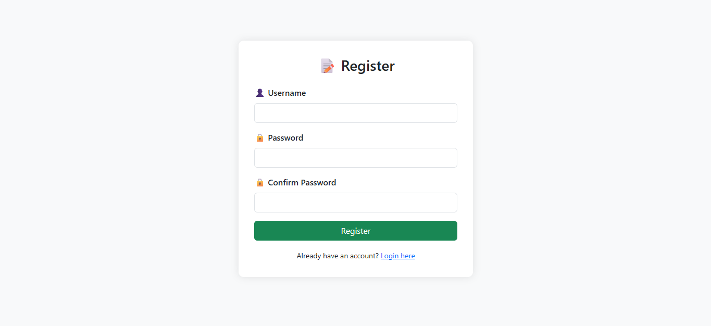

# Flask Task Manager App

A lightweight **CRUD (Create, Read, Update, Delete)** task manager built with **Flask**, **SQLite**, and **SQLAlchemy**, supporting **user registration/login**, task assignment, and priority management.

---

## Features

- User Authentication (Register, Login, Logout)
- Create, Edit, Delete Tasks
- Tasks linked to logged-in users
- Fields: title, description, status, due date, priority, category, notes
- Bootstrap-styled UI with flash messages
- Password hashing via `werkzeug.security`

---

## Screenshots





---

## Tech Stack

- **Python 3**
- **Flask**
- **SQLite**
- **SQLAlchemy**
- **Jinja2 Templates**
- **Bootstrap 4/5 (optional)**

---

## Installation & Running

### Prerequisites

- Python 3.x
- `pip`
- (Optional) Virtual environment

### Installation

```bash
git clone https://github.com/KennethMasilela/flask_crud_task_app.git
cd flask-crud-app
python -m venv venv
source venv/bin/activate  # On Windows: venv\Scripts\activate
pip install -r requirements.txt
